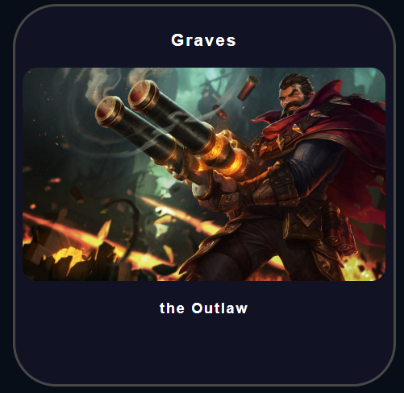
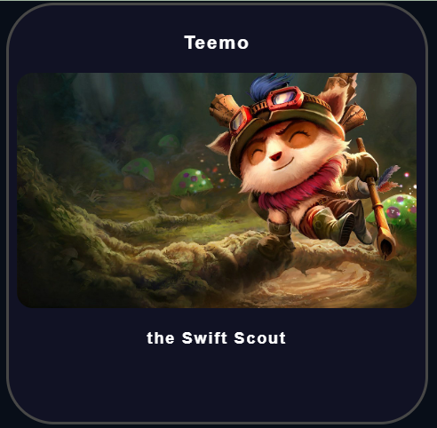
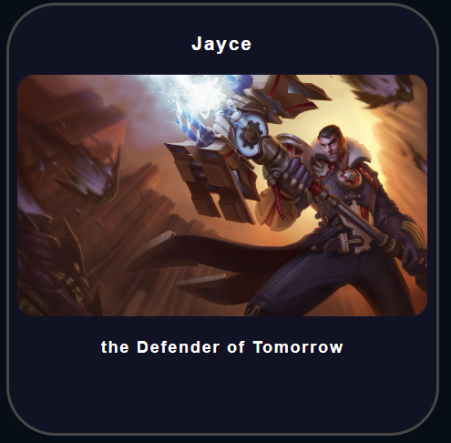
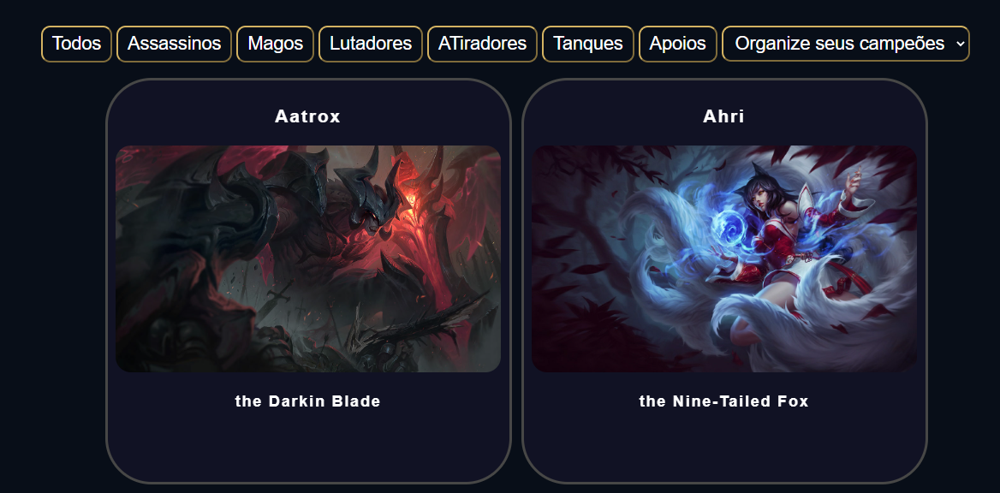
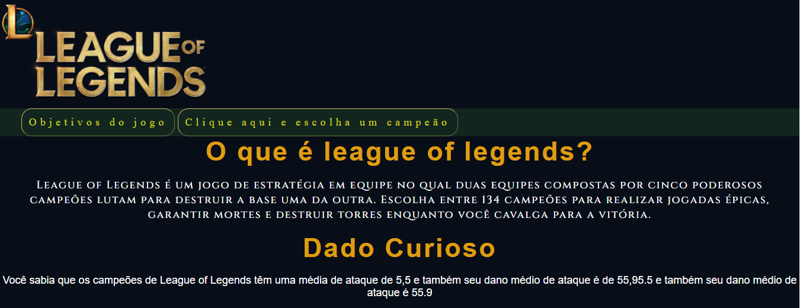

# Data lovers League of legends

#Resumo do Projeto:
Fan-page "Um mundo de aventura com os melhores guerreiros da liga":
A fan-page "league of legends", é uma página direcionada aos fãs, a fim de oferecer informações e curiosidades sobre suas produções. Para isso contamos com os "Serviços de buscas de personagens", uma interface de busca de dados com filtros direcionados às necessidades dos seus usuários. Necessidades estas, descobertas a partir da pesquisa com usuários fornecida.

# Conteúdos
* [Os usuários e suas histórias...](#os-usuários-e-suas-histórias)
* [A paleta de cores](#a-paleta-de-cores)
* [A implementação](#a-implementação)
* [Protótipo de alta fidelidade](#protótipo-de-alta-fidelidade)
* [Personagens](#personagens)

#Sobre a desenvolvedora
Tenho grande aspiração por jogos de guerra e batalhas, gosto de jogos de desafios onde me faz montar estatégias contra meus inimigos,devido a isso escolhe o league para esse desafio.

#Os usuários e suas histórias...
A partir da minha  pesquisa e da mesma fornecida, feita com usuários potenciais, escolhi suas principais histórias, e seus pontos mais relevantes, e concluí que para eles seria de suma importância:

Ter acesso completo com informações como: sobre, produção, data de lançamento, entre outras, de forma organizada;

Ter acesso a lista ao personagens dos mais antigos para os mais recentes e vice-versa;

Ter acesso a avaliação por nota da crítica, de cada personagem de forma organizada;

Conhecer os criadores, e quantas e quais, personagens e jogos criaram;

#A implementação:
Busquei através de botões de fácil acesso exibir os dados buscados pelo usuário na tela. Também a exibição da porcentagem de personagens e suas habilidades , Dividi o site em duas páginas para facilitar essa exibição.

# # Personagens

# Alta fidelidade

# Sobre mim:
[Vanessa Borges](https://github.com/vanessavb92)

Estudante da turma 007 da Laboratoria Brasil, com apenas 3 meses de experiência visando aproveitar ao máximo os objetivos de aprendizagem com o projeto proposto.

